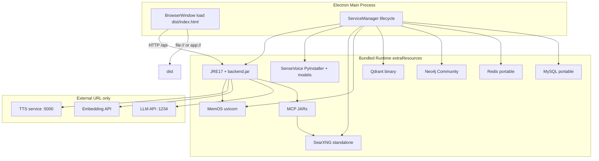

# 全依赖 exe/dmg 打包方案

## 目标与边界

| 组件 | 策略 |
|------|------|
| **SenseVoice ASR** | 程序 + 模型权重 **全部打进安装包** |
| **TTS** | 不打包；用户已独立部署，通过 `runtime-config.json` / 设置页填 URL |
| **Embedding** | 不打包；调用外部 URL（与 LLM 可同机不同端口） |
| **LLM** | 不打包；LM Studio / 远程 OpenAI 兼容 API |
| **MySQL / Redis / Neo4j / Qdrant** | 随包附带各平台便携二进制，Electron 启动时拉起 |
| **MemOS** | 随包附带 Python 服务 + 上述图/向量库 |
| **SearXNG** | 随包附带（**不用 Docker**），替代当前 [`services/searxng/docker-compose.yml`](services/searxng/docker-compose.yml) |
| **Backend + MCP JARs** | 随包附带 trimmed JRE + `AI-Chat.jar` + MCP stdio JARs |
| **前端** | Vite 静态资源内嵌 Electron，**不再依赖 dev 时的 `:3000` Vite 服务** |

当前缺口（需新建）：
- [`client/package.json`](client/package.json) 无 `electron-builder` 配置，[`client/electron/main.js`](client/electron/main.js) 硬编码 `http://localhost:3000` + 开 DevTools
- 无 `application-packaged.yml` profile
- 无进程编排层；[`startup-scripts/start-all.sh`](startup-scripts/start-all.sh) 仅适用于开发机 shell 环境

---

## 目标架构



**启动顺序**（有依赖，需 health check 串行）：
1. Redis → MySQL（执行 [`backend/init.sql`](backend/init.sql) 若 data 目录为空）
2. Neo4j → Qdrant → MemOS（:8000）
3. SearXNG（:8888）
4. SenseVoice ASR（:9000）
5. Spring Boot（:8080，`--spring.profiles.active=packaged`）
6. 打开 Electron 窗口

退出时逆序 `SIGTERM` + 超时 `kill -9`（Win 用 `taskkill`）。

---

## 目录布局（安装包内）

```
AI-Chat.app / AI-Chat.exe
└── Contents/Resources/   (electron-builder extraResources)
    ├── runtime/
    │   ├── jre/                    # jlink 裁剪 JRE 17
    │   ├── backend/
    │   │   └── AI-Chat.jar
    │   ├── mcp/
    │   │   ├── searxng-mcp-server.jar
    │   │   └── prime-mcp-server.jar
    │   ├── mysql/                  # 平台对应便携版
    │   ├── redis/
    │   ├── neo4j/
    │   ├── qdrant/
    │   ├── memos/                  # MemOS 源码/venv + 启动脚本
    │   ├── searxng/                # 二进制 + settings.yml
    │   └── asr/
    │       ├── sensevoice-server   # PyInstaller 产物
    │       └── models/             # iic/SenseVoiceSmall 等预下载权重
    └── config/
        ├── application-packaged.yml
        ├── runtime-config.json     # 默认外部 LLM/Embedding/TTS URL
        └── mcp-servers.json        # 内置 searxng MCP 指向 localhost:8888
```

**可写数据**（不放进只读 Resources）：
- macOS: `~/Library/Application Support/AI-Chat/data/`
- Windows: `%APPDATA%/AI-Chat/data/`

子目录：`mysql/`、`redis/`、`neo4j/`、`qdrant/`、`logs/`、用户覆盖的 `runtime-config.json`。

[`AppPaths.java`](backend/src/main/java/org/example/aichat/mcp/AppPaths.java) 需支持打包模式：`app.project-root` 指向 Resources 根，config 优先读 userData 可写副本。

---

## 代码改动要点

### 1. Electron 生产模式 + 进程编排

新建 [`client/electron/service-manager.js`](client/electron/service-manager.js)：
- 解析 `process.resourcesPath` / `app.isPackaged`
- 按平台选择二进制路径（`process.platform` / `process.arch`）
- 统一 health check（复用 [`startup-scripts/start-all.sh`](startup-scripts/start-all.sh) 里的 curl 逻辑，Node 用 `fetch`）
- 启动失败时弹窗 + 打开 `logs/` 路径

改造 [`client/electron/main.js`](client/electron/main.js)：
- 生产：`mainWindow.loadFile(path.join(__dirname, '../dist/index.html'))`，关闭 DevTools
- 开发：保持现有 `localhost:3000`
- `app.whenReady` 先 `await serviceManager.startAll()` 再建窗口
- `before-quit` 调用 `serviceManager.stopAll()`

前端 API 基址：生产环境 axios/fetch 指向 `http://127.0.0.1:8080`（可在 [`client/src/src/utils/runtimeConfig.js`](client/src/src/utils/runtimeConfig.js) 加 `import.meta.env.PROD` 分支，或 Vite `define`）。

### 2. Spring Boot 打包 profile

新建 [`backend/src/main/resources/application-packaged.yml`](backend/src/main/resources/application-packaged.yml)：
- `app.project-root: ${AI_CHAT_HOME:}`（由 Electron 启动 jar 时注入环境变量）
- MySQL/Redis/Memos 全部 `localhost` 固定端口
- `voice.asr-url: http://127.0.0.1:9000/...`
- `voice.astra-tts-base-url` / `embedding.base-url` / `llm.base-url` 留占位，**以 userData 下 `runtime-config.json` 为准**（已有 [`RuntimeConfigService`](backend/src/main/java/org/example/aichat/config/RuntimeConfigService.java) 热加载机制）
- MCP JAR 路径改为 `${app.project-root}/runtime/mcp/...`

[`application.yml`](backend/src/main/resources/application.yml) 增加注释；打包构建时用 `-Dspring.profiles.active=packaged` 或通过 Electron 传参。

### 3. SenseVoice 打包

在 [`services/sense-voice/`](services/sense-voice/) 新增：
- `build.spec` / `build-mac.sh` / `build-win.sh`：PyInstaller 单文件或 onedir
- 模型预下载脚本 `scripts/download-asr-models.sh`：把 `iic/SenseVoiceSmall` + VAD 权重下载到 `runtime/asr/models/`，运行时设 `MODELSCOPE_CACHE` / `FUNASR_MODEL_DIR` 指向包内目录（改 [`server.py`](services/sense-voice/server.py) 支持 `SENSEVOICE_MODEL_DIR` 环境变量）
- macOS 需打包 `ffmpeg` 二进制（[`server.py`](services/sense-voice/server.py) 依赖 ffmpeg 转码）

### 4. 基础设施便携版

新建 [`packaging/`](packaging/) 目录（脚本 + 文档，不放 git 大二进制）：
- `fetch-runtime.sh`：按 OS 下载 MySQL/Redis/Neo4j/Qdrant 官方或社区便携包到 `packaging/cache/`
- `init-mysql.sh`：首次启动 `--initialize-insecure`，导入 [`backend/init.sql`](backend/init.sql)
- Neo4j / Qdrant 最小配置模板（单用户、本地 bind）
- MemOS：vendor 固定版本 MemTensor/MemOS，`pip install` 到 embedded venv，`.env` 指向包内 Neo4j/Qdrant 端口；MemOS 内部 LLM 调用指向用户配置的 LLM URL（与主后端共用）

**SearXNG 去 Docker 化**：
- 使用 searxng 源码 + granian/uwsgi 子进程，或预编译 wheel
- 复用现有 [`services/searxng/searxng/settings.yml`](services/searxng/searxng/settings.yml)
- MCP 仍走 [`searxng-mcp-server`](services/searxng-mcp-server/) stdio，无需改 Java 逻辑

### 5. electron-builder 配置

扩展 [`client/package.json`](client/package.json)：

```json
{
  "scripts": {
    "build:mac": "vite build && electron-builder --mac dmg",
    "build:win": "vite build && electron-builder --win nsis"
  },
  "build": {
    "appId": "org.example.aichat",
    "productName": "AI-Chat",
    "directories": { "output": "release" },
    "files": ["dist/**", "electron/**"],
    "extraResources": [{ "from": "../packaging/staging/${platform}", "to": "runtime", "filter": ["**/*"] }],
    "mac": { "target": ["dmg"], "arch": ["arm64"] },
    "win": { "target": ["nsis"], "arch": ["x64"] }
  }
}
```

顶层新增 [`scripts/package-all.sh`](scripts/package-all.sh)：
1. `./scripts/build-all.sh`（已有：MCP JAR + backend JAR + client dist）
2. `./packaging/stage-runtime.sh mac|win`（组装 extraResources）
3. `cd client && npm run build:mac|win`

---

## 平台差异

| 项 | macOS dmg | Windows exe |
|----|-----------|-------------|
| SenseVoice | MPS 优先（现有 [`pick_device()`](services/sense-voice/server.py)） | CPU 为主（Win 显存留给 LLM） |
| 二进制 | arm64 专用 MySQL/Redis/Neo4j/Qdrant | x64 专用 |
| 代码签名 | Apple Developer ID（否则 Gatekeeper 拦截） | Authenticode（可选） |
| 体积预估 | ~3–6 GB（含 ASR 模型 + 四套 DB） | 类似 |

TTS / Embedding / LLM 在首次启动向导或设置页提示用户填写 URL（默认可预填 `http://127.0.0.1:1234/v1` 与 `http://localhost:5000`）。

---

## 分阶段交付（建议）

**Phase A — 可运行的「壳 + 后端 + 前端」**（验证 Electron 打包链路）
- electron-builder dmg/exe
- 内嵌 JRE + backend.jar + dist
- 仍假设本机已有 MySQL/Redis（或手动先起便携版）
- 改 main.js 生产加载路径

**Phase B — SenseVoice 全量内置**
- PyInstaller + 模型预下载 + ServiceManager 拉起 ASR
- `application-packaged.yml` 固定 asr-url

**Phase C — 基础设施便携版**
- MySQL/Redis 自动 init + 数据目录隔离
- Neo4j + Qdrant + MemOS 串联
- 验证 [`MemosClient`](backend/src/main/java/org/example/aichat/service/memos/MemosClient.java) 与现有 cube_id/user_id

**Phase D — SearXNG + MCP 闭环**
- 去 Docker 的 SearXNG 子进程
- 端到端 `webSearch` 工具可用

**Phase E —  polish**
- 首次启动配置向导（LLM / Embedding / TTS URL）
- 托盘图标、一键重启服务、日志导出
- CI：Mac 打 dmg、Win 打 exe（分机器构建）

---

## 风险与缓解

- **体积大**：ASR 模型 + 四套数据库便携包；Acceptable per 你的选择。二进制放 `.gitignore`，CI 构建时下载。
- **MemOS 复杂度**：Neo4j + Qdrant + MemOS 三进程；启动慢 → 启动画面 + 分步 health check。
- **SenseVoice 在 Win CPU 慢**：可接受；ASR 仍可用，GPU 留给 LLM。
- **端口冲突**：打包版使用固定端口段（3306/6379/7474/6333/8000/8888/9000/8080），启动前检测并提示。
- **跨机 TTS**：打包版默认 `astraTtsBaseUrl` 可填局域网 IP（与现 [`application-local.yml`](backend/src/main/resources/application-local.yml) 一致）。

---

## 关键文件清单

| 操作 | 文件 |
|------|------|
| 新建 | `client/electron/service-manager.js` |
| 改 | `client/electron/main.js` |
| 改 | `client/package.json`（electron-builder） |
| 新建 | `backend/src/main/resources/application-packaged.yml` |
| 改 | `backend/.../AppPaths.java`（packaged 路径 + userData） |
| 改 | `services/sense-voice/server.py`（包内模型路径） |
| 新建 | `packaging/` 脚本集 + `scripts/package-all.sh` |
| 改 | `client/src` 前端 API base URL 生产分支 |
| 文档 | `docs/packaging.md`（构建步骤、外部服务 URL 说明） |
